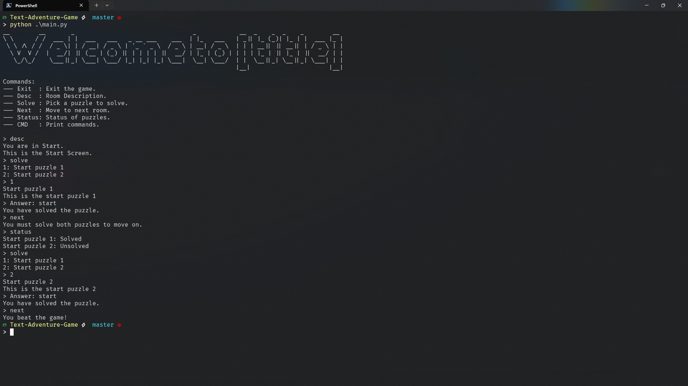

# Text Adventure Game

Extendable by:
- adding puzzle functions
- modify choose_puzzle()
- init new puzzles
- init new rooms

Work flow:
- Create a new function (puzzle) in `puzzle.py`
- Modify `choose_puzzle()` with the puzzle name
- Init the new puzzle in `game.py`
- Add the puzzle to a room
  - or init a new room for that new puzzle
- Test puzzle

